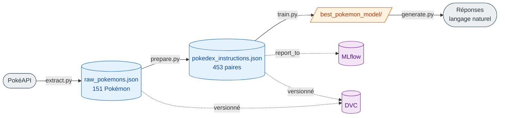

# PoC — Pokémon LLM


Preuve de concept (PoC) d'un pipeline MLOps complet pour **fine-tuner un petit modèle de langage** (TinyLlama 1.1B) afin qu'il réponde à des questions sur les Pokémon de la première génération, sous forme de fiches Pokédex en français.

Le projet illustre une chaîne de bout en bout : **extraction de données → préparation → fine-tuning supervisé**, avec versionnage des données via **DVC** et suivi des expériences via **MLflow**.

> 📚 **Documentation complète** dans le dossier [`docs/`](docs/README.md) : installation, architecture, données, entraînement, inférence, suivi MLflow/DVC, dépannage, limites et CI/CD.

---

## 🎯 Objectif

Entraîner un modèle conversationnel léger à répondre à des questions du type :

> **Q :** « Donne-moi la fiche Pokedex de Bulbasaur. »
>
> **R :** « Bulbasaur est un Pokémon de type Plante, Poison. Il mesure 0.7m et pèse 6.9kg. Ses talents sont : overgrow. Ses statistiques de base sont - PV: 45, Attaque: 49, Défense: 49, Vitesse: 45. »

---

## 🏗️ Architecture du pipeline



| Étape | Script | Entrée | Sortie |
|-------|--------|--------|--------|
| 1. Extraction | [src/extract.py](src/extract.py) | PokéAPI (REST) | `data/raw_pokemons.json` |
| 2. Préparation | [src/prepare.py](src/prepare.py) | `data/raw_pokemons.json` | `data/pokedex_instructions.json` |
| 3. Fine-tuning | [src/train.py](src/train.py) | `data/pokedex_instructions.json` | `best_pokemon_model/` |

---

## 📦 Détail des étapes

### 1. Extraction — `src/extract.py`
Récupère les **151 premiers Pokémon** depuis [PokéAPI](https://pokeapi.co/), avec une pause de 0,5 s entre chaque requête pour respecter l'API. Pour chaque Pokémon, on ne conserve que les informations utiles : `id`, `name`, `types`, `stats`, `abilities` (hors talents cachés), `height` (en mètres) et `weight` (en kg).

### 2. Préparation — `src/prepare.py`
Transforme les données brutes en un **dataset d'instructions** au format `{instruction, input, output}`. Les types sont traduits en français et, pour chaque Pokémon, **3 variantes de questions** sont générées (augmentation de données) → **453 paires** d'entraînement (151 × 3).

### 3. Fine-tuning — `src/train.py`
Fine-tune le modèle de base **`TinyLlama/TinyLlama-1.1B-Chat-v1.0`** avec la librairie 🤗 `transformers` :
- 3 epochs, batch size 2, learning rate `5e-5`, longueur max 256 tokens
- Précision mixte (`fp16`) automatique si un GPU est disponible
- Suivi des métriques et des artefacts via **MLflow**
- Checkpoints sauvegardés dans `results/`, modèle final dans `best_pokemon_model/`

---

## 💻 Prérequis

- **Python 3.13**
- **Git** et **DVC** (pour récupérer les données versionnées)
- Matériel recommandé pour le fine-tuning complet de TinyLlama 1.1B :
  - **GPU** : carte avec ≥ 8 Go de VRAM (l'entraînement bascule automatiquement en `fp16`)
  - **CPU** : possible mais lent — prévoir ≥ 16 Go de RAM et un temps d'entraînement nettement plus long
  - **Espace disque** : ~5 Go (modèle de base + checkpoints + artefacts MLflow)

---

## 🚀 Installation

```bash
# Cloner le dépôt
git clone https://github.com/alice-444/poc-pokemon-llm.git
cd poc-pokemon-llm

# Créer et activer l'environnement virtuel (Python 3.13)
python -m venv .venv
source .venv/bin/activate

# Installer les dépendances
pip install -r requirements.txt
```

---

## ▶️ Utilisation

Exécute les étapes **dans cet ordre** pour aller des données brutes jusqu'au modèle utilisable :

```bash
python src/extract.py                  # (1) Extraction des 151 Pokémon depuis PokéAPI
python src/prepare.py                  # (2) Génération du dataset d'instructions
python src/train.py                    # (3) Fine-tuning du modèle (long)
python best_pokemon_model/generate.py  # (4) Interroger le modèle entraîné
```

Chaque étape consomme la sortie de la précédente — il faut donc respecter l'ordre. Le détail de l'étape (4) est décrit plus bas dans [Interroger le modèle fine-tuné](#interroger-le-modèle-fine-tuné-inférence).

### Alternative : via DVC

Les données sont versionnées avec DVC. Plutôt que de relancer l'extraction et la préparation manuellement, tu peux les récupérer/reconstruire :

```bash
dvc pull          # remplace l'étape (1) : télécharge raw_pokemons.json déjà extrait
dvc repro         # remplace l'étape (2) : rejoue « prepare » si une dépendance a changé
```

> ℹ️ `dvc pull` et `python src/extract.py` produisent le même fichier `raw_pokemons.json` : utilise l'un **ou** l'autre, pas les deux. Idem pour `dvc repro` et `python src/prepare.py`.

### Suivre l'entraînement avec MLflow
```bash
mlflow ui                 # puis ouvrir http://localhost:5000
```
L'expérience est enregistrée sous le nom **`pokemon-llm-finetuning`** (base `mlflow.db`, artefacts dans `mlruns/`).

### Interroger le modèle fine-tuné (inférence)
Une fois l'entraînement terminé, le modèle est disponible dans `best_pokemon_model/`. Un script prêt à l'emploi est fourni :

```bash
python best_pokemon_model/generate.py
```

Pour poser ta propre question, modifie la variable `question` à la fin de [best_pokemon_model/generate.py](best_pokemon_model/generate.py) :

```python
question = "Donne-moi la fiche Pokedex de Pikachu."
```

Le script charge le modèle (GPU si disponible, sinon CPU), applique le **même template de prompt** que l'entraînement (`### Instruction: ... ### Réponse: ...`, voir [src/train.py](src/train.py)) et n'affiche que la réponse générée.

---

## 🗂️ Structure du projet

```
poc-pokemon-llm/
├── data/
│   ├── raw_pokemons.json            # données brutes (suivi DVC)
│   └── pokedex_instructions.json    # dataset d'instructions généré
├── src/
│   ├── extract.py                   # 1. extraction PokéAPI
│   ├── prepare.py                   # 2. mise en forme du dataset
│   ├── validate.py                  # validation d'intégrité des données (CI)
│   └── train.py                     # 3. fine-tuning + MLflow
├── best_pokemon_model/              # modèle fine-tuné final
├── results/                         # checkpoints d'entraînement
├── mlruns/ , mlflow.db              # tracking MLflow
├── dvc.yaml , dvc.lock              # définition du pipeline DVC
├── .github/workflows/               # pipeline CI/CD (GitHub Actions)
└── notebooks/                       # exploration
```

---

## 🛠️ Stack technique

- **Python 3.13**
- **🤗 Transformers / Datasets** — fine-tuning supervisé
- **PyTorch** — backend d'entraînement
- **TinyLlama 1.1B Chat** — modèle de base
- **DVC** — versionnage des données et orchestration du pipeline
- **MLflow** — suivi des expériences et des artefacts
- **GitHub Actions** — CI : rejoue le pipeline (extract → prepare → validate → train léger) à chaque push ([détails](docs/09-ci-cd.md))
- **PokéAPI** — source de données

---

## ⚠️ Notes

- Il s'agit d'un **PoC pédagogique** : le dataset est volontairement petit et le modèle léger pour permettre un entraînement sur machine modeste.
- L'entraînement est un fine-tuning complet (pas de LoRA/PEFT) ; prévoir suffisamment de mémoire selon le matériel.

---

## 📄 Licence

Distribué sous licence **MIT**. Les données proviennent de [PokéAPI](https://pokeapi.co/) ; *Pokémon* et les noms associés sont des marques déposées de Nintendo / Game Freak / The Pokémon Company — ce projet est purement éducatif et non commercial.

---

## 🙋 Auteur

Réalisés par [@alice-444](https://github.com/alice-444) & [@remimoul](https://github.com/remimoul).
