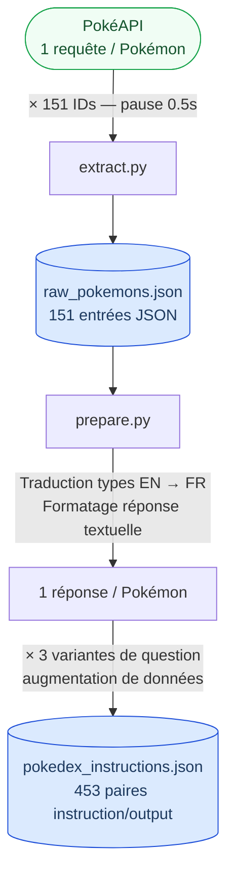
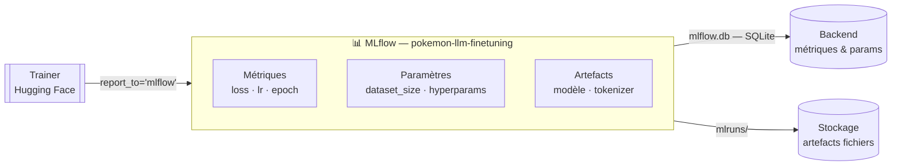
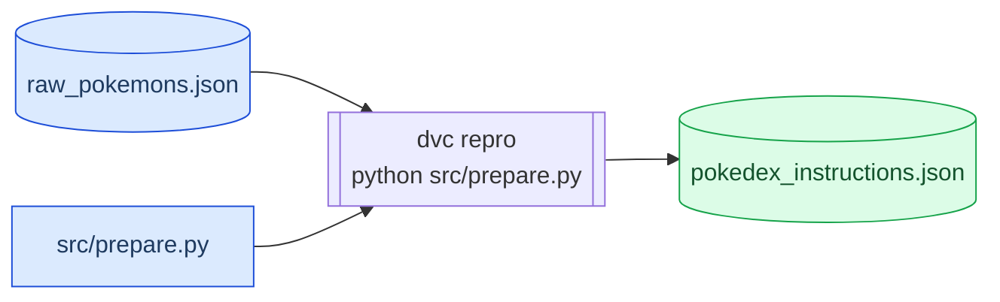

<div align="center">

# 🔴 PoC — Pokémon LLM

<p align="center">
  <em>Fine-tuning d'un petit modèle de langage pour générer des fiches Pokédex en français</em>
</p>

<p align="center">
  
  
  
  
</p>

<p align="center">
  
  
  
  
</p>

---

**Preuve de concept** d'un pipeline MLOps de bout en bout pour entraîner un LLM léger à répondre à des questions sur les Pokémon de la 1ʳᵉ génération, sous forme de fiches Pokédex en français.

📚 **[Documentation complète →](docs/README.md)**

</div>

---

## 🎯 Démonstration

<table>
<tr>
<td width="50%" valign="top">

**Entrée utilisateur**
```
Donne-moi la fiche Pokedex de Bulbasaur.
```

</td>
<td width="50%" valign="top">

**Réponse générée**
```
Bulbasaur est un Pokémon de type Plante,
Poison. Il mesure 0.7m et pèse 6.9kg.
Ses talents sont : overgrow.
Ses statistiques de base sont —
PV: 45, Attaque: 49, Défense: 49,
Vitesse: 45.
```

</td>
</tr>
</table>

---

## 🏗️ Architecture du pipeline

```mermaid
flowchart LR
    API([🌐 PokéAPI]):::ext -->|"extract.py\n151 requêtes"| RAW[("📦 raw_pokemons.json\n151 Pokémon")]:::data
    RAW -->|"prepare.py\ntraduction + 3 variantes"| INST[("🗂️ pokedex_instructions.json\n453 paires")]:::data
    INST -->|"train.py\nfine-tuning SFT"| MODEL[/"🧠 best_pokemon_model\//]:::model
    MODEL -->|generate.py| OUT([💬 Réponses\nlangage naturel]):::ext

    INST -.-|logged| MLF[(📊 MLflow)]:::track
    RAW -.-|versionné| DVC[(📌 DVC)]:::track
    INST -.-|versionné| DVC

    classDef data fill:#dbeafe,stroke:#1d4ed8,color:#1e3a5f
    classDef model fill:#fef3c7,stroke:#d97706,color:#78350f
    classDef track fill:#f3e8ff,stroke:#7c3aed,color:#4c1d95
    classDef ext fill:#f0fdf4,stroke:#16a34a,color:#14532d
```

---

## 📦 Les 3 étapes du pipeline

| | Étape | Script | Rôle | Entrée → Sortie |
|:---:|-------|--------|------|-----------------|
| 1️⃣ | Extraction | [`src/extract.py`](src/extract.py) | Récupère les données brutes | PokéAPI → `data/raw_pokemons.json` |
| 2️⃣ | Préparation | [`src/prepare.py`](src/prepare.py) | Génère le dataset d'instructions | `raw_pokemons.json` → `pokedex_instructions.json` |
| 3️⃣ | Fine-tuning | [`src/train.py`](src/train.py) | Entraîne le modèle + suivi MLflow | `pokedex_instructions.json` → `best_pokemon_model/` |

---

## 🧠 Modèle de base : TinyLlama 1.1B

> **Pourquoi TinyLlama ?** Sa légèreté (1,1 milliard de paramètres) permet un fine-tuning complet sur une machine personnelle modeste — objectif clé d'un PoC.

| Propriété | Valeur |
|-----------|--------|
| Modèle de base | [`TinyLlama/TinyLlama-1.1B-Chat-v1.0`](https://huggingface.co/TinyLlama/TinyLlama-1.1B-Chat-v1.0) |
| Architecture | `LlamaForCausalLM` |
| Paramètres | ~1,1 milliard |
| Couches | 22 |
| Contexte max | 2 048 tokens |
| Vocabulaire | 32 000 tokens |

### Template de prompt (identique entraînement & inférence)

```
### Instruction:
{question posée par l'utilisateur}

### Réponse:
{fiche Pokédex générée}<eos>
```

---

## 📊 Données : de l'API au dataset


```mermaid
flowchart TD
    A([PokéAPI\n1 requête / Pokémon]) -->|"× 151 IDs — pause 0.5s"| B[extract.py]
    B --> C[("raw_pokemons.json\n151 entrées JSON")]
    C --> D[prepare.py]
    D -->|"Traduction types EN → FR\nFormatage réponse textuelle"| E[1 réponse / Pokémon]
    E -->|"× 3 variantes de question\naugmentation de données"| F[("pokedex_instructions.json\n453 paires instruction/output")]

    style A fill:#f0fdf4,stroke:#16a34a,color:#14532d
    style C fill:#dbeafe,stroke:#1d4ed8,color:#1e3a5f
    style F fill:#dbeafe,stroke:#1d4ed8,color:#1e3a5f
```

**3 variantes de question générées par Pokémon :**

| # | Question générée |
|---|-----------------|
| 1 | *« Quelles sont les caractéristiques de `{nom}` ? »* |
| 2 | *« Donne-moi la fiche Pokedex de `{nom}`. »* |
| 3 | *« Peux-tu me décrire le Pokémon `{nom}` (types, stats, talents) ? »* |

> **Résultat :** 151 Pokémon × 3 = **453 paires d'entraînement**

---

## ⚙️ Hyperparamètres d'entraînement

| Paramètre | Valeur | Commentaire |
|-----------|--------|-------------|
| `num_train_epochs` | `3` | Passages complets sur le dataset |
| `per_device_train_batch_size` | `2` | Petit batch pour éviter l'OOM |
| `learning_rate` | `5e-5` | — |
| `weight_decay` | `0.01` | Régularisation L2 |
| `max_length` | `256` | Longueur max des séquences tokenisées |
| `fp16` | `auto` | Activé si GPU CUDA disponible |
| `logging_steps` | `10` | Log MLflow toutes les 10 étapes |
| `save_steps` | `100` | Checkpoint tous les 100 pas |
| `report_to` | `"mlflow"` | Intégration Hugging Face ↔ MLflow |

> **Nombre de pas estimé :** 453 exemples × 3 epochs ÷ batch 2 ≈ **681 pas**

---

## 📈 Suivi MLOps

### MLflow — Expériences & métriques


```mermaid
flowchart LR
    TRAIN[["Trainer\nHugging Face"]] -->|"report_to='mlflow'"| MLF

    subgraph MLF ["📊 MLflow — pokemon-llm-finetuning"]
        direction TB
        M["Métriques\nloss · lr · epoch"]
        P["Paramètres\ndataset_size · hyperparams"]
        A["Artefacts\nmodèle · tokenizer"]
    end

    MLF -->|"mlflow.db — SQLite"| DB[("Backend\nmétriques & params")]
    MLF -->|"mlruns/"| FS[("Stockage\nartefacts fichiers")]
```

```bash
# Visualiser l'interface MLflow localement
mlflow ui   # → http://localhost:5000
```

### DVC — Versionnage des données


```mermaid
flowchart LR
    RAW[("raw_pokemons.json")]:::dep --> STAGE
    SCRIPT["src/prepare.py"]:::dep --> STAGE
    STAGE[["dvc repro\npython src/prepare.py"]] --> OUT[("pokedex_instructions.json")]:::out

    classDef dep fill:#dbeafe,stroke:#1d4ed8,color:#1e3a5f
    classDef out fill:#dcfce7,stroke:#16a34a,color:#14532d
```

| Commande | Effet |
|----------|-------|
| `dvc pull` | Récupère les données versionnées depuis le remote |
| `dvc repro` | Rejoue le pipeline si une dépendance a changé |
| `dvc status` | Montre ce qui est désynchronisé |
| `dvc commit` | Sauvegarde un nouvel état des données |

---

## 🗂️ Structure du projet

```
poc-pokemon-llm/
│
├── 📁 src/
│   ├── extract.py                  # 1. Extraction PokéAPI
│   ├── prepare.py                  # 2. Génération du dataset d'instructions
│   ├── train.py                    # 3. Fine-tuning + tracking MLflow
│   └── validate.py                 # Validation qualité des données (CI)
│
├── 📁 data/
│   ├── raw_pokemons.json           # Données brutes (suivi DVC)
│   └── pokedex_instructions.json   # Dataset d'entraînement (suivi DVC)
│
├── 📁 best_pokemon_model/          # Modèle fine-tuné final
│   ├── model.safetensors           # Poids du modèle (~2,1 Go)
│   ├── tokenizer.json              # Tokenizer
│   ├── config.json                 # Configuration du modèle
│   └── generate.py                 # Script d'inférence prêt à l'emploi
│
├── 📁 results/                     # Checkpoints intermédiaires
├── 📁 mlruns/                      # Artefacts MLflow
├── 📁 docs/                        # Documentation complète (8 guides)
│
├── mlflow.db                       # Base SQLite MLflow (métriques & params)
├── dvc.yaml                        # Définition du pipeline DVC
├── dvc.lock                        # État versionné du pipeline
└── requirements.txt                # Dépendances Python
```

---

## 🚀 Installation & utilisation

### Prérequis

- **Python 3.13**
- **Git** + **DVC**
- Matériel recommandé :
  - GPU ≥ 8 Go VRAM (entraînement en `fp16` automatique)
  - CPU possible mais lent (prévoir ≥ 16 Go RAM)
  - ~5 Go d'espace disque (modèle + checkpoints + MLflow)

### Installation

```bash
# Cloner le dépôt
git clone https://github.com/alice-444/poc-pokemon-llm.git
cd poc-pokemon-llm

# Créer et activer l'environnement virtuel
python -m venv .venv
source .venv/bin/activate   # Windows : .venv\Scripts\activate

# Installer les dépendances
pip install -r requirements.txt
```

### Exécution du pipeline

```bash
# ── Option A — Pipeline complet manuel ──────────────────────────────────────
python src/extract.py                  # ~80s — extrait les 151 Pokémon
python src/prepare.py                  # génère 453 paires d'instructions
python src/train.py                    # fine-tuning (long)
python best_pokemon_model/generate.py  # inférence

# ── Option B — Via DVC (données déjà versionnées) ───────────────────────────
dvc pull                               # remplace python src/extract.py
dvc repro                              # remplace python src/prepare.py
python src/train.py
python best_pokemon_model/generate.py
```

### Interroger le modèle

```bash
python best_pokemon_model/generate.py
```

Modifier la variable `question` dans [`best_pokemon_model/generate.py`](best_pokemon_model/generate.py) :

```python
question = "Donne-moi la fiche Pokedex de Pikachu."
```

### Suivre l'entraînement en temps réel

```bash
mlflow ui   # → http://localhost:5000
```

---

## 🛠️ Stack technique

| Catégorie | Outil | Rôle |
|-----------|-------|------|
| **Langage** | Python 3.13 | — |
| **Data** | PokéAPI | Source de données Pokémon |
| **ML — Modèle** | TinyLlama 1.1B | Modèle de base à fine-tuner |
| **ML — Framework** | PyTorch | Backend d'entraînement |
| **ML — Librairie** | 🤗 Transformers | Fine-tuning supervisé (SFT) |
| **ML — Librairie** | 🤗 Datasets | Chargement et préparation du dataset |
| **MLOps — Tracking** | MLflow | Suivi des expériences & artefacts |
| **MLOps — Data** | DVC | Versionnage des données & pipeline |

---

## ⚠️ Limites & pistes d'amélioration

> Ce projet est un **PoC pédagogique** : il démontre une chaîne MLOps complète, pas un modèle de production.

| Limite | Explication |
|--------|-------------|
| **Hallucinations** | Le modèle peut inventer des stats ou des talents (dataset trop petit) |
| **Dataset restreint** | 151 Pokémon × 3 reformulations = peu de diversité linguistique |
| **Génération 1 uniquement** | PokéAPI en propose plus de 1 000 |
| **Fine-tuning complet** | Coûteux en mémoire — LoRA/QLoRA serait plus adapté à grande échelle |
| **Pas d'évaluation factuelle** | Seule la `loss` est suivie, pas la qualité des réponses |

**Pistes d'amélioration :**
- 📈 **Données** — Ajouter descriptions Pokédex, évolutions, faiblesses, plus de générations
- ⚡ **Entraînement** — Adopter LoRA/PEFT pour réduire la mémoire GPU
- 📐 **Évaluation** — Calculer un taux d'exactitude factuelle vs `raw_pokemons.json`
- 🚀 **Industrialisation** — Servir via FastAPI ou Gradio, intégrer l'entraînement au pipeline DVC

---

## 📄 Licence

Distribué sous licence **MIT**. Les données proviennent de [PokéAPI](https://pokeapi.co/). *Pokémon* et les noms associés sont des marques déposées de Nintendo / Game Freak / The Pokémon Company — ce projet est purement éducatif et non commercial.

---

<div align="center">

Réalisé par [@alice-444](https://github.com/alice-444) — projet de démonstration MLOps

</div>
