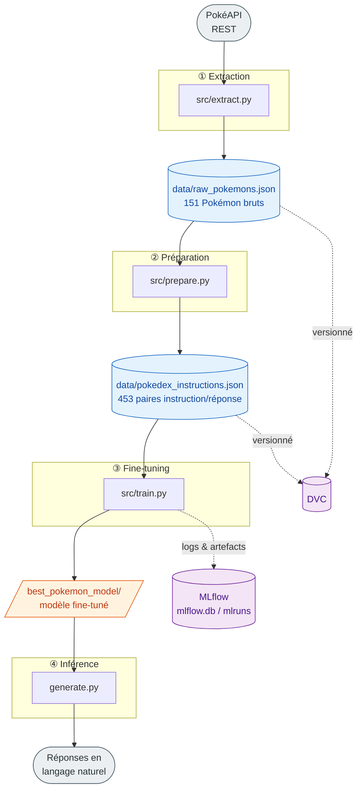

# 2. Architecture & pipeline

[← Installation](01-installation.md) · [Sommaire](README.md) · [Suivant : Données →](03-donnees.md)

## Vue d'ensemble

Le projet est un pipeline MLOps linéaire en 4 étapes. Chaque étape produit un artefact consommé par la suivante.



## Les étapes en détail

| #   | Script                                                                | Entrée                           | Sortie                            | Doc                                |
| --- | --------------------------------------------------------------------- | -------------------------------- | --------------------------------- | ---------------------------------- |
| 1   | [`src/extract.py`](../src/extract.py)                                 | PokéAPI (REST)                   | `data/raw_pokemons.json`          | [Données](03-donnees.md)           |
| 2   | [`src/prepare.py`](../src/prepare.py)                                 | `data/raw_pokemons.json`         | `data/pokedex_instructions.json`  | [Données](03-donnees.md)           |
| 3   | [`src/train.py`](../src/train.py)                                     | `data/pokedex_instructions.json` | `best_pokemon_model/`, `results/` | [Entraînement](04-entrainement.md) |
| 4   | [`best_pokemon_model/generate.py`](../best_pokemon_model/generate.py) | `best_pokemon_model/`            | texte                             | [Inférence](05-inference.md)       |

> 🔬 Un script transverse [`src/validate.py`](../src/validate.py) contrôle l'intégrité des fichiers JSON (entre les étapes 2 et 3). Il est surtout utilisé par la [CI](09-ci-cd.md) mais peut être lancé manuellement : `python src/validate.py --min-count 10`. Détails dans [Données](03-donnees.md).

## Ordre d'exécution

Les étapes **doivent** être lancées dans l'ordre, car chacune dépend de la sortie de la précédente :

```bash
python src/extract.py                  # (1)
python src/prepare.py                  # (2)
python src/train.py                    # (3)
python best_pokemon_model/generate.py  # (4)
```

### Variante DVC pour les étapes 1 et 2

Les données sont versionnées avec DVC. Tu peux donc remplacer l'extraction et la préparation manuelles :

```bash
dvc pull     # remplace (1) : récupère raw_pokemons.json déjà extrait
dvc repro    # remplace (2) : rejoue « prepare » si une dépendance a changé
```

> ⚠️ `dvc pull` et `python src/extract.py` produisent le **même** fichier. Utilise l'un **ou** l'autre. Voir [Suivi : DVC](06-suivi-mlflow-dvc.md).

## Arborescence

```
poc-pokemon-llm/
├── data/
│   ├── raw_pokemons.json            # (1) données brutes — versionné DVC
│   └── pokedex_instructions.json    # (2) dataset d'instructions
├── src/
│   ├── extract.py                   # (1) extraction PokéAPI
│   ├── prepare.py                   # (2) mise en forme du dataset
│   ├── validate.py                  # validation d'intégrité des données (CI)
│   └── train.py                     # (3) fine-tuning + MLflow
├── best_pokemon_model/              # (3) modèle final
│   └── generate.py                  # (4) script d'inférence
├── results/                         # (3) checkpoints intermédiaires
├── mlruns/ , mlflow.db              # tracking MLflow
├── dvc.yaml , dvc.lock              # pipeline DVC
├── .github/workflows/               # pipeline CI/CD (GitHub Actions)
├── docs/                            # cette documentation
└── notebooks/                       # exploration
```

## Stack technique

- **Python 3.13**
- **🤗 Transformers / Datasets** — fine-tuning supervisé
- **PyTorch** — backend d'entraînement et d'inférence
- **TinyLlama 1.1B Chat** — modèle de base ([détails](04-entrainement.md))
- **DVC** — versionnage des données et du pipeline
- **MLflow** — suivi des expériences
- **PokéAPI** — source de données
