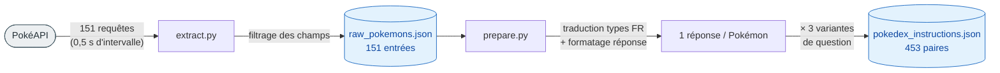

# 3. Données

[← Architecture](02-architecture.md) · [Sommaire](README.md) · [Suivant : Entraînement →](04-entrainement.md)

Cette étape couvre les scripts [`extract.py`](../src/extract.py) (extraction) et [`prepare.py`](../src/prepare.py) (mise en forme).



---

## 3.1 Extraction — `src/extract.py`

### Rôle

Récupère les **151 premiers Pokémon** (première génération) depuis [PokéAPI](https://pokeapi.co/api/v2/pokemon/).

### Fonctionnement

- Boucle sur les IDs `1` à `151`.
- Pause de **0,5 s** entre chaque requête pour respecter l'API (politesse / éviter le throttling).
- Timeout de 10 s par requête, avec gestion des erreurs (codes HTTP, exceptions réseau).
- Ne conserve que les champs utiles au LLM.

### Champs extraits

| Champ       | Source PokéAPI           | Transformation                    |
| ----------- | ------------------------ | --------------------------------- |
| `id`        | `data.id`                | —                                 |
| `name`      | `data.name`              | `.capitalize()`                   |
| `types`     | `data.types[].type.name` | liste                             |
| `stats`     | `data.stats[]`           | dict `{nom: valeur}`              |
| `abilities` | `data.abilities[]`       | talents **non cachés** uniquement |
| `height`    | `data.height`            | décimètres → **mètres** (÷ 10)    |
| `weight`    | `data.weight`            | hectogrammes → **kg** (÷ 10)      |

### Sortie : `data/raw_pokemons.json`

```json
{
    "id": 1,
    "name": "Bulbasaur",
    "types": ["grass", "poison"],
    "stats": {
        "hp": 45, "attack": 49, "defense": 49,
        "special-attack": 65, "special-defense": 65, "speed": 45
    },
    "abilities": ["overgrow"],
    "height": 0.7,
    "weight": 6.9
}
```

### Lancer

```bash
python src/extract.py              # 151 Pokémon (défaut)
python src/extract.py --limit 10   # dataset réduit (utilisé par la CI)
```

| Flag      | Défaut | Effet                                                              |
| --------- | ------ | ------------------------------------------------------------------ |
| `--limit` | 151    | Nombre de Pokémon à extraire ; réduire pour un test rapide / la CI |

> ⏱️ ~80 s (151 × 0,5 s de pause + temps réseau). Pour éviter de réinterroger l'API, le fichier est versionné via DVC : `dvc pull`.

---

## 3.2 Préparation — `src/prepare.py`

### Rôle
Transforme les données brutes en un **dataset d'instructions** prêt pour le fine-tuning supervisé.

### Transformations appliquées

1. **Traduction des types** en français (`grass` → `Plante`, `fire` → `Feu`, `water` → `Eau`, etc.).
2. **Formatage de la réponse** en une phrase descriptive type fiche Pokédex.
3. **Augmentation de données** : 3 formulations de question par Pokémon.

### Augmentation : 3 variantes par Pokémon

```text
1. « Quelles sont les caractéristiques de {nom} ? »
2. « Donne-moi la fiche Pokedex de {nom}. »
3. « Peux-tu me décrire le Pokémon {nom} (types, stats, talents) ? »
```

→ **151 Pokémon × 3 = 453 paires** d'entraînement.

### Format de sortie : `data/pokedex_instructions.json`

Chaque entrée suit le schéma `instruction / input / output` :

```json
{
    "instruction": "Donne-moi la fiche Pokedex de Bulbasaur.",
    "input": "",
    "output": "Bulbasaur est un Pokémon de type Plante, Poison. Il mesure 0.7m et pèse 6.9kg. Ses talents sont : overgrow. Ses statistiques de base sont - PV: 45, Attaque: 49, Défense: 49, Vitesse: 45."
}
```

> Le champ `input` est toujours vide ici (pas de contexte additionnel), mais conservé pour rester compatible avec le format d'instruction standard (Alpaca-like).

### Lancer

```bash
python src/prepare.py
# ou via DVC :
dvc repro
```

---

## 3.3 Validation — `src/validate.py`

### Rôle

Vérifie l'**intégrité et la cohérence** des deux fichiers JSON produits avant de lancer l'entraînement. Conçu pour la [CI](09-ci-cd.md), mais lançable à tout moment en local.

### Ce qui est vérifié

**`raw_pokemons.json`** :
- fichier présent et JSON valide, contenant une **liste** ;
- au moins `--min-count` Pokémon ;
- pour chaque entrée, présence des clés `id, name, types, stats, abilities, height, weight` ;
- `types`/`abilities` = listes de chaînes, `stats` = dict contenant au moins `hp, attack, defense, speed`, `height`/`weight` = nombres positifs.

**`pokedex_instructions.json`** :
- liste non vide de dicts avec les clés `instruction, input, output` ;
- `instruction` et `output` non vides ;
- **cohérence** : `nb_instructions == nb_pokemon × 3` (3 variantes par Pokémon).

### Lancer

```bash
python src/validate.py                  # min-count = 1 (défaut)
python src/validate.py --min-count 10   # exige au moins 10 Pokémon (CI)
```

| Flag          | Défaut | Effet                                                       |
| ------------- | ------ | ----------------------------------------------------------- |
| `--min-count` | 1      | Nombre minimum de Pokémon attendus dans `raw_pokemons.json` |

Le script sort avec le code **0** si tout est valide, **1** sinon (utilisable comme garde-fou dans un pipeline).

---

## Note sur le versionnage

Les deux fichiers (`raw_pokemons.json` et `pokedex_instructions.json`) sont exclus de Git (voir `data/.gitignore`) et gérés par **DVC**. L'étape `prepare` est déclarée dans [`dvc.yaml`](../dvc.yaml). Détails dans [Suivi : DVC](06-suivi-mlflow-dvc.md).
