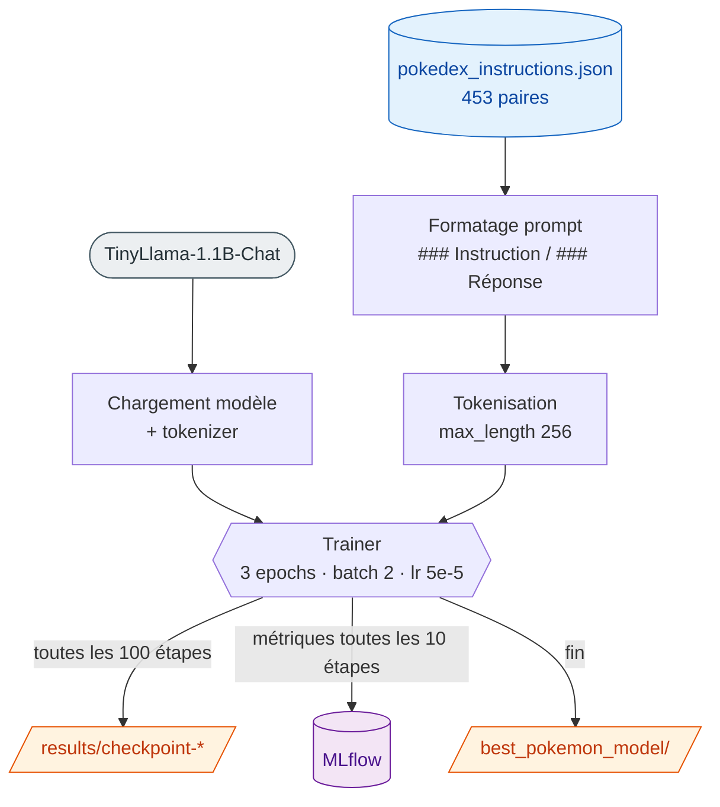

# 4. Entraînement

[← Données](03-donnees.md) · [Sommaire](README.md) · [Suivant : Inférence →](05-inference.md)

Script concerné : [`src/train.py`](../src/train.py).



## Modèle de base

| Propriété        | Valeur                                                                                            |
| ---------------- | ------------------------------------------------------------------------------------------------- |
| Modèle           | [`TinyLlama/TinyLlama-1.1B-Chat-v1.0`](https://huggingface.co/TinyLlama/TinyLlama-1.1B-Chat-v1.0) |
| Architecture     | `LlamaForCausalLM`                                                                                |
| Paramètres       | ~1,1 milliard                                                                                     |
| Couches          | 22                                                                                                |
| Dimension cachée | 2048                                                                                              |
| Contexte max     | 2048 tokens                                                                                       |
| Vocabulaire      | 32 000 tokens                                                                                     |

TinyLlama est choisi pour sa **légèreté** : il permet un fine-tuning complet sur du matériel modeste, ce qui est l'objectif d'un PoC.

## Template de prompt

Le texte d'entraînement assemble instruction et réponse selon ce format (le **même** doit être utilisé à l'inférence) :

```text
### Instruction:
{instruction}

### Réponse:
{output}<eos>
```

- `<eos>` (token de fin) est ajouté pour apprendre au modèle à **s'arrêter**.
- Tokenisation : `max_length=256`, `truncation=True`, `padding="max_length"`.
- Si le tokenizer n'a pas de token de padding, on lui assigne le token `eos`.

## Hyperparamètres (`TrainingArguments`)

| Paramètre                     | Valeur      | Commentaire                      |
| ----------------------------- | ----------- | -------------------------------- |
| `num_train_epochs`            | 3           | passages complets sur le dataset |
| `per_device_train_batch_size` | 2           | petit batch pour éviter l'OOM    |
| `learning_rate`               | 5e-5        | —                                |
| `weight_decay`                | 0.01        | régularisation                   |
| `max_length` (tokenisation)   | 256         | longueur des séquences           |
| `fp16`                        | auto        | activé si GPU CUDA disponible    |
| `logging_steps`               | 10          | log toutes les 10 étapes         |
| `save_steps`                  | 100         | checkpoint tous les 100 pas      |
| `output_dir`                  | `./results` | checkpoints intermédiaires       |
| `report_to`                   | `mlflow`    | envoi des logs à MLflow          |

### Nombre de pas

```
453 exemples × 3 epochs ÷ batch_size 2 ≈ 681 pas
```

D'où les checkpoints `results/checkpoint-100` … `results/checkpoint-681`.

## Sorties produites

| Chemin                 | Contenu                                                                            |
| ---------------------- | ---------------------------------------------------------------------------------- |
| `best_pokemon_model/`  | modèle final + tokenizer (`model.safetensors`, `config.json`, `tokenizer.json`, …) |
| `results/checkpoint-*` | checkpoints intermédiaires (tous les 100 pas)                                      |
| `mlruns/`, `mlflow.db` | métriques et artefacts MLflow                                                      |

## Lancer l'entraînement

```bash
python src/train.py
```

Pendant l'exécution :

- les métriques (loss, learning rate…) sont loguées dans MLflow sous l'expérience **`pokemon-llm-finetuning`** ;
- un paramètre personnalisé `dataset_size` est enregistré ;
- à la fin, le modèle et le tokenizer sont sauvegardés dans `best_pokemon_model/`.

> ⏱️ La durée dépend fortement du matériel. Sur CPU, compter plusieurs dizaines de minutes ; sur GPU, quelques minutes.

Pour suivre l'entraînement en temps réel, voir [Suivi : MLflow](06-suivi-mlflow-dvc.md).

### Mode CI : `--ci`

Le flag `--ci` lance un entraînement **minimal**, conçu pour valider le pipeline en intégration continue sans GPU ni temps de calcul significatif :

```bash
python src/train.py --ci
```

| Aspect             | Normal             | `--ci`                          |
| ------------------ | ------------------ | ------------------------------- |
| `num_train_epochs` | 3                  | 1                               |
| Nombre de pas      | ~681               | **20 max** (`max_steps=20`)     |
| Device             | GPU si dispo       | **CPU forcé** (`no_cuda=True`)  |
| `fp16`             | auto               | désactivé                       |
| Suivi MLflow       | actif              | désactivé (`report_to="none"`)  |

Le modèle produit en mode CI n'a aucune valeur de qualité : l'objectif est uniquement de vérifier que l'entraînement s'exécute sans erreur. Voir [CI/CD](09-ci-cd.md).

## Aller plus loin

Ce PoC fait un **fine-tuning complet** (tous les poids sont mis à jour). Pour réduire l'empreinte mémoire, on pourrait utiliser LoRA/PEFT — voir [Limites & pistes](08-limites.md).
