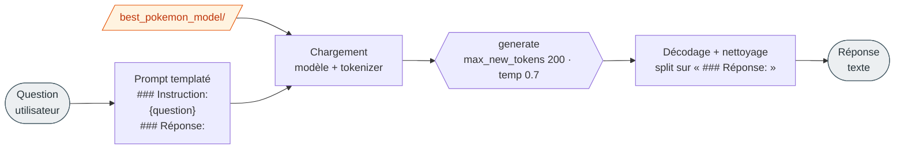

# 5. Inférence

[← Entraînement](04-entrainement.md) · [Sommaire](README.md) · [Suivant : Suivi →](06-suivi-mlflow-dvc.md)

Une fois l'entraînement terminé, le modèle est disponible dans `best_pokemon_model/`. Le script [`generate.py`](../best_pokemon_model/generate.py) permet de l'interroger.



## Utilisation rapide

```bash
python best_pokemon_model/generate.py
```

Pour poser ta propre question, modifie la variable `question` à la fin du script :

```python
question = "Donne-moi la fiche Pokedex de Pikachu."
```

## Comment ça marche

1. **Chargement** : le modèle est chargé depuis le dossier du script lui-même (`os.path.dirname(__file__)`), donc le script fonctionne quel que soit le répertoire de lancement.
2. **Device** : GPU (`cuda`, `fp16`) si disponible, sinon CPU (`fp32`).
3. **Prompt** : la question est insérée dans le **même template** qu'à l'entraînement :
   ```text
   ### Instruction:
   {question}

   ### Réponse:
   ```
4. **Génération** puis **nettoyage** : seul le texte après `### Réponse:` est renvoyé.

## Paramètres de génération

| Paramètre        | Valeur                   | Effet                                            |
| ---------------- | ------------------------ | ------------------------------------------------ |
| `max_new_tokens` | 200                      | longueur max de la réponse                       |
| `temperature`    | 0.7                      | créativité (0.1 = robotique, 1.0 = très créatif) |
| `do_sample`      | `True`                   | échantillonnage activé (sinon greedy)            |
| `pad_token_id`   | `tokenizer.pad_token_id` | évite les warnings de padding                    |

Ajuste ces valeurs en haut de la fonction `generer_reponse_pokemon` dans [`generate.py`](../best_pokemon_model/generate.py).

## Exemple de sortie

```text
Question : Quelles sont les caractéristiques de Bulbizarre ?
Réponse du modèle :
Bulbizarre est un Pokémon de type Plante, Poison. Ses talents sont : ...
Ses statistiques de base sont - PV: ..., Attaque: ..., Défense: ..., Vitesse: ...
```

> ⚠️ **Important** : le modèle reproduit fidèlement le *format* d'une fiche Pokédex, mais peut **inventer les valeurs** (stats, talents). C'est une limite attendue d'un PoC entraîné sur peu de données — voir [Limites & pistes](08-limites.md).

## Charger le modèle dans ton propre code

Si tu veux intégrer le modèle ailleurs :

```python
import os, torch
from transformers import AutoModelForCausalLM, AutoTokenizer

model_path = "best_pokemon_model"          # chemin relatif depuis la racine du projet
tokenizer = AutoTokenizer.from_pretrained(model_path)
model = AutoModelForCausalLM.from_pretrained(
    model_path,
    dtype=torch.float16 if torch.cuda.is_available() else torch.float32,
)
model.to("cuda" if torch.cuda.is_available() else "cpu")

prompt = "### Instruction:\nDonne-moi la fiche Pokedex de Pikachu.\n\n### Réponse:\n"
inputs = tokenizer(prompt, return_tensors="pt").to(model.device)
outputs = model.generate(**inputs, max_new_tokens=200, do_sample=True, temperature=0.7)
print(tokenizer.decode(outputs[0], skip_special_tokens=True))
```

> Le respect du template `### Instruction: ... ### Réponse:` est **essentiel** : c'est ce que le modèle a appris. Un autre format dégrade fortement les réponses.
