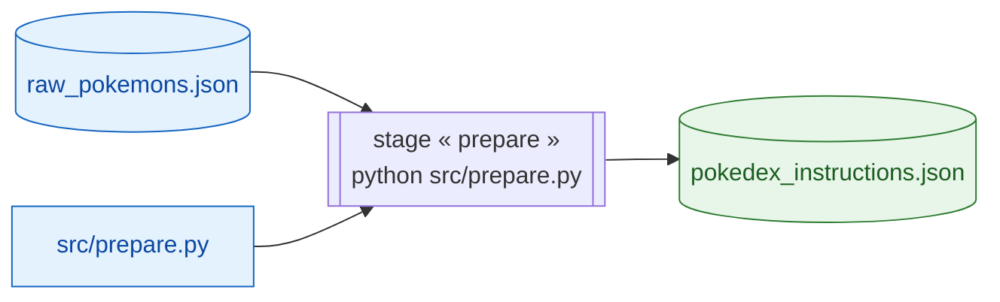

# 6. Suivi : MLflow & DVC

[← Inférence](05-inference.md) · [Sommaire](README.md) · [Suivant : Dépannage →](07-depannage.md)

Deux outils assurent la reproductibilité : **MLflow** (suivi des expériences) et **DVC** (versionnage des données).

---

## 6.1 MLflow — suivi des expériences

### Configuration dans le code

Dans [`src/train.py`](../src/train.py) :

- `mlflow.set_experiment("pokemon-llm-finetuning")` définit l'expérience.
- `report_to="mlflow"` dans les `TrainingArguments` envoie automatiquement les métriques de 🤗 Transformers.
- `HF_MLFLOW_LOG_ARTIFACTS=True` active la sauvegarde du modèle dans les artefacts.
- `mlflow.log_param("dataset_size", ...)` enregistre un paramètre personnalisé.

### Ce qui est suivi

| Type       | Exemples                                                |
| ---------- | ------------------------------------------------------- |
| Métriques  | `loss`, `learning_rate`, `epoch` (toutes les 10 étapes) |
| Paramètres | `dataset_size`, hyperparamètres d'entraînement          |
| Artefacts  | modèle final, tokenizer                                 |

### Visualiser les runs

```bash
mlflow ui
# puis ouvrir http://localhost:5000
```

| Élément                     | Emplacement              |
| --------------------------- | ------------------------ |
| Backend (métriques, params) | `mlflow.db` (SQLite)     |
| Artefacts                   | `mlruns/`                |
| Nom de l'expérience         | `pokemon-llm-finetuning` |

> Si `mlflow ui` n'affiche rien, vérifie que tu le lances depuis la racine du projet (là où se trouvent `mlflow.db` et `mlruns/`). Au besoin : `mlflow ui --backend-store-uri sqlite:///mlflow.db`.

---

## 6.2 DVC — versionnage des données

### Principe

Les fichiers de données sont **trop volumineux / régénérables** pour être stockés dans Git. DVC les versionne via des fichiers `.dvc` légers (et `dvc.lock`), tandis que Git ignore les vrais fichiers (voir `data/.gitignore`).

### Le pipeline déclaré

[`dvc.yaml`](../dvc.yaml) définit l'étape `prepare` :

```yaml
stages:
  prepare:
    cmd: python src/prepare.py
    deps:
      - data/raw_pokemons.json
      - src/prepare.py
    outs:
      - data/pokedex_instructions.json
```

DVC connaît ainsi les **dépendances** (entrées) et les **sorties** de l'étape, et ne la rejoue que si une dépendance a changé.



> Si l'un des deux nœuds bleus (dépendances) change, `dvc repro` régénère la sortie verte. Sinon, l'étape est ignorée (cache).

### Commandes utiles

| Commande     | Effet                                                      |
| ------------ | ---------------------------------------------------------- |
| `dvc pull`   | récupère les données versionnées (ex. `raw_pokemons.json`) |
| `dvc repro`  | rejoue le pipeline si une dépendance a changé              |
| `dvc status` | montre ce qui est désynchronisé                            |
| `dvc dag`    | affiche le graphe des étapes                               |

### Articulation avec les scripts

| Étape manuelle          | Équivalent DVC                                |
| ----------------------- | --------------------------------------------- |
| `python src/extract.py` | `dvc pull` (récupère le fichier déjà extrait) |
| `python src/prepare.py` | `dvc repro` (rejoue « prepare »)              |

> ⚠️ N'enchaîne pas les deux : ils produisent le même fichier. Choisis le flux manuel **ou** le flux DVC.
