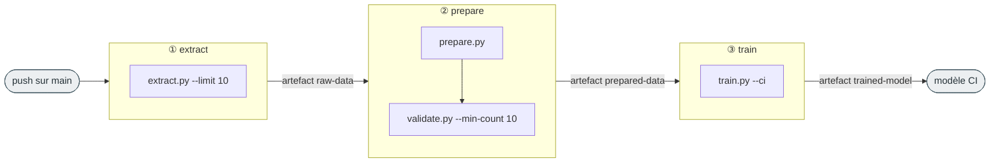

# 9. Intégration continue (CI/CD)

[← Limites](08-limites.md) · [Sommaire](README.md)

Le projet rejoue automatiquement le pipeline ML à chaque `push` sur `main` via **GitHub Actions**. Le workflow est défini dans [`.github/workflows/ml-pipeline.yml`](../.github/workflows/ml-pipeline.yml).

Objectif : **valider que la chaîne extraction → préparation → entraînement fonctionne de bout en bout**, sur un dataset réduit et en quelques minutes — pas produire un modèle de production.



## Déclenchement

```yaml
on:
  push:
    branches: [main]
```

Une `concurrency` annule le run précédent si un nouveau push arrive (`cancel-in-progress: true`).

## Les 3 jobs

| Job | Commande clé | Rôle | Timeout |
| --- | ------------ | ---- | ------- |
| **extract** | `python src/extract.py --limit 10` | Extrait seulement **10 Pokémon** (CI rapide) | 10 min |
| **prepare** | `python src/prepare.py` puis `python src/validate.py --min-count 10` | Génère le dataset (30 paires) **et valide son intégrité** | 5 min |
| **train** | `python src/train.py --ci` | Fine-tuning **léger CPU** (1 epoch, 20 steps max, sans MLflow) | 30 min |

Chaque job s'exécute sur un runner séparé et se passe les fichiers via des **artefacts** (`upload-artifact` / `download-artifact`) : `raw-data` → `prepared-data` → `trained-model`. Les jobs s'enchaînent grâce à `needs:` (`prepare` needs `extract`, `train` needs `prepare`).

## Mode CI vs mode normal

Le code adapte son comportement pour rester rapide et déterministe en CI :

| Aspect | Local (normal) | CI |
| ------ | -------------- | -- |
| Nb de Pokémon extraits | 151 (`--limit` par défaut) | 10 (`--limit 10`) |
| Validation des données | manuelle / facultative | automatique (`validate.py`) |
| Entraînement | 3 epochs, GPU si dispo, `fp16` | `--ci` : 1 epoch, **20 steps max**, CPU forcé (`no_cuda`) |
| Suivi MLflow | actif (`report_to="mlflow"`) | désactivé (`report_to="none"`) |

> Le mode CI est piloté par le flag `--ci` dans [`src/train.py`](../src/train.py) (paramètre `ci_mode`). Voir le détail des flags dans [Entraînement](04-entrainement.md) et [Données](03-donnees.md).

## Reproduire la CI en local

Tu peux exécuter exactement la même séquence sur ta machine :

```bash
python src/extract.py --limit 10        # dataset réduit
python src/prepare.py
python src/validate.py --min-count 10   # validation
python src/train.py --ci                # entraînement léger CPU
```

## CI/CD vs DVC

Deux orchestrations coexistent et ne se recouvrent pas :

- **DVC** (local) : versionne les données et rejoue l'étape `prepare` si une dépendance change — voir [Suivi : DVC](06-suivi-mlflow-dvc.md). `dvc.yaml` ne déclare aujourd'hui que `prepare`.
- **GitHub Actions** (distant) : rejoue extract + prepare + validate + train à chaque push, **sans passer par DVC** (les données sont ré-extraites depuis PokéAPI en version réduite, puis transmises en artefacts).

> 💡 Piste : déclarer aussi `extract` et `train` dans `dvc.yaml` permettrait à la CI d'appeler `dvc repro` plutôt que les scripts un par un. Voir [Limites & pistes](08-limites.md).
