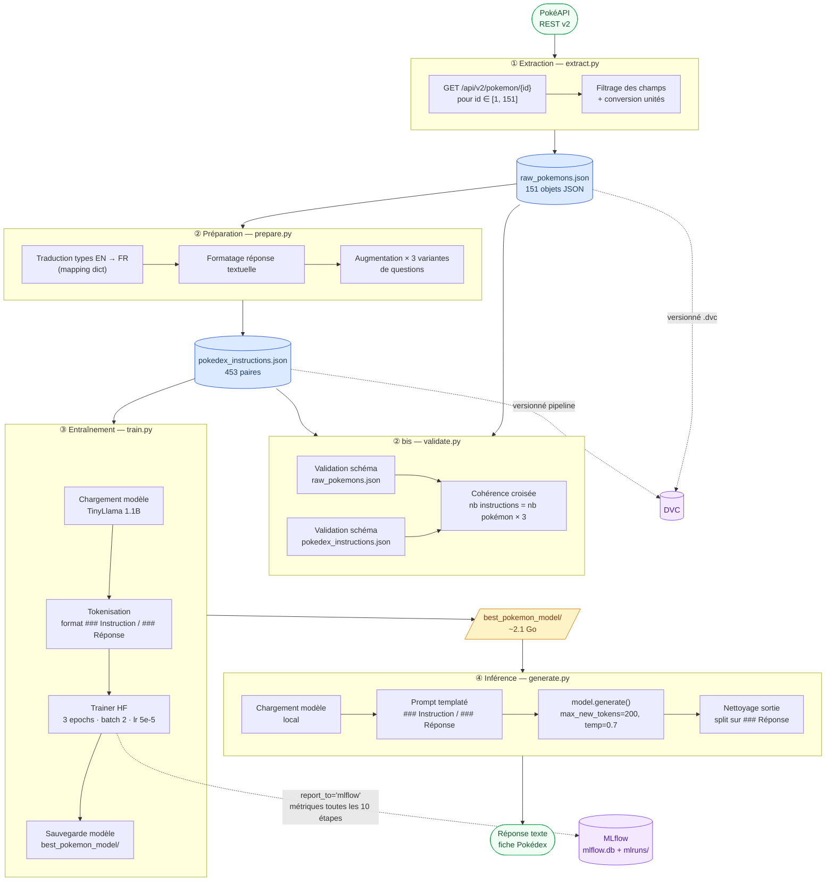
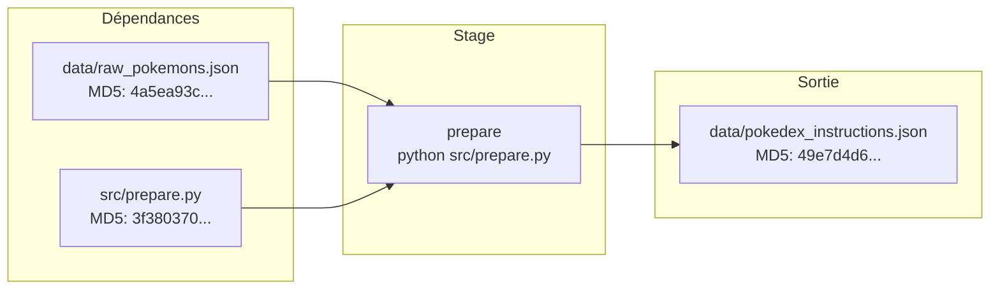
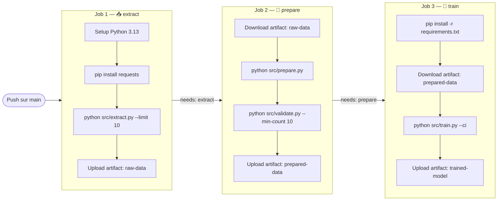
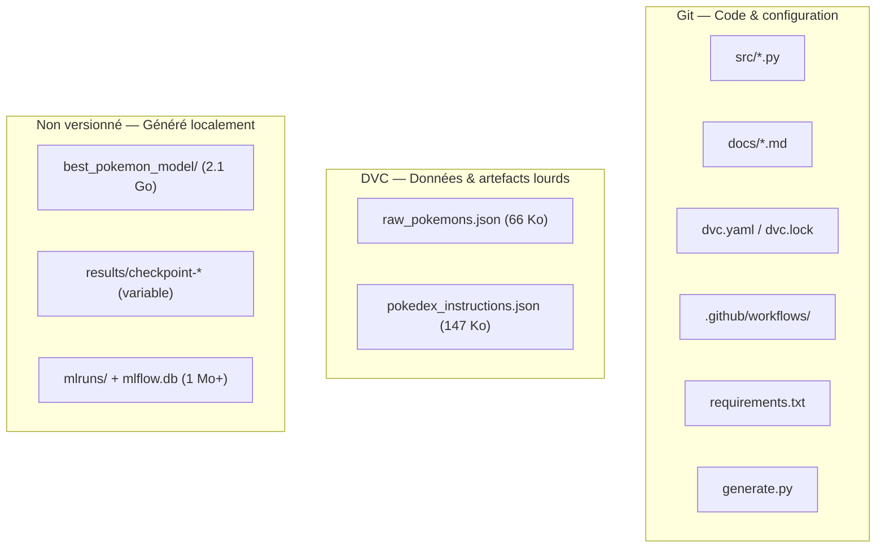

# 📘 Documentation Technique — PoC Pokémon LLM

> Document de référence technique exhaustif.
> Dernière mise à jour : juillet 2026.

---

## Table des matières

1. [Vue d'ensemble du système](#1-vue-densemble-du-système)
2. [Architecture technique détaillée](#2-architecture-technique-détaillée)
3. [Scripts du pipeline — Analyse complète](#3-scripts-du-pipeline--analyse-complète)
   - [3.1 `src/extract.py` — Extraction](#31-srcextractpy--extraction)
   - [3.2 `src/prepare.py` — Préparation](#32-srcpreparepy--préparation)
   - [3.3 `src/train.py` — Entraînement](#33-srctrainpy--entraînement)
   - [3.4 `src/validate.py` — Validation des données](#34-srcvalidatepy--validation-des-données)
   - [3.5 `best_pokemon_model/generate.py` — Inférence](#35-best_pokemon_modelgeneratepy--inférence)
4. [Modèle TinyLlama — Configuration technique](#4-modèle-tinyllama--configuration-technique)
5. [Format des données](#5-format-des-données)
6. [Pipeline DVC](#6-pipeline-dvc)
7. [Tracking MLflow](#7-tracking-mlflow)
8. [CI/CD — GitHub Actions](#8-cicd--github-actions)
9. [Stratégie de versionnage (Git + DVC)](#9-stratégie-de-versionnage-git--dvc)
10. [Dépendances et environnement](#10-dépendances-et-environnement)
11. [Arborescence complète du projet](#11-arborescence-complète-du-projet)
12. [Glossaire](#12-glossaire)

---

## 1. Vue d'ensemble du système

Ce projet implémente un **pipeline MLOps linéaire de bout en bout** dont l'objectif est de fine-tuner le modèle de langage **TinyLlama 1.1B** pour qu'il génère des fiches Pokédex structurées en français, à partir d'une question en langage naturel.

### Caractéristiques clés

| Propriété | Valeur |
|-----------|--------|
| **Type de projet** | PoC pédagogique — démonstration MLOps |
| **Tâche ML** | Fine-tuning supervisé (SFT) d'un LLM causal |
| **Modèle de base** | `TinyLlama/TinyLlama-1.1B-Chat-v1.0` (1,1 Md de paramètres) |
| **Source de données** | [PokéAPI](https://pokeapi.co/) (REST, publique) |
| **Périmètre** | 151 Pokémon (1ʳᵉ génération) |
| **Dataset d'entraînement** | 453 paires instruction/réponse (151 × 3 variantes) |
| **Versionnage des données** | DVC |
| **Suivi des expériences** | MLflow |
| **CI/CD** | GitHub Actions (3 jobs séquentiels) |
| **Licence** | MIT |

---

## 2. Architecture technique détaillée

### Diagramme de flux complet



### Flux de données résumé

```
PokéAPI (151 GET)
    ↓
raw_pokemons.json         66 Ko   — 151 objets JSON
    ↓
pokedex_instructions.json 147 Ko  — 453 paires {instruction, input, output}
    ↓
best_pokemon_model/       ~2.1 Go — modèle fine-tuné SafeTensors
    ↓
Réponse textuelle         ~50-200 tokens
```

---

## 3. Scripts du pipeline — Analyse complète

### 3.1 `src/extract.py` — Extraction

> **Rôle** : Interroge la PokéAPI pour récupérer les données brutes des Pokémon et les sauvegarder en JSON.

#### Dépendances

```python
import os, json, time, requests
```

#### Fonction principale

| Fonction | Signature | Description |
|----------|-----------|-------------|
| `fetch_pokemon_data` | `(limit: int = 151) → list[dict]` | Boucle sur les IDs `1` à `limit`, effectue un `GET` par Pokémon avec gestion des erreurs |

#### Constantes et valeurs codées en dur

| Valeur | Emplacement | Signification |
|--------|-------------|---------------|
| `151` | `--limit` (défaut) | Nombre de Pokémon à extraire (1ʳᵉ génération) |
| `0.5` | `time.sleep(0.5)` | Délai de courtoisie entre chaque requête API (en secondes) |
| `10` | `timeout=10` | Timeout HTTP par requête (en secondes) |
| `"https://pokeapi.co/api/v2/pokemon/"` | `base_url` | URL de base de la PokéAPI v2 |

#### Transformations appliquées aux données

| Champ extrait | Source PokéAPI | Transformation |
|---------------|----------------|----------------|
| `id` | `data["id"]` | Aucune |
| `name` | `data["name"]` | `.capitalize()` |
| `types` | `data["types"][i]["type"]["name"]` | Liste de chaînes |
| `stats` | `data["stats"][i]` | Dict `{stat_name: base_stat}` |
| `abilities` | `data["abilities"][i]` | Liste (exclut les talents cachés : `if not a["is_hidden"]`) |
| `height` | `data["height"]` | `÷ 10` (décimètres → mètres) |
| `weight` | `data["weight"]` | `÷ 10` (hectogrammes → kilogrammes) |

#### Gestion des erreurs

- Vérifie `response.status_code == 200` avant de traiter la réponse.
- Bloc `try/except Exception` global par requête (protège contre les erreurs réseau, timeout, JSON invalide).
- Les Pokémon en erreur sont ignorés (le script continue avec les suivants).

#### Entrée/Sortie

| | Détail |
|---|--------|
| **Entrée** | PokéAPI REST (réseau) |
| **Sortie** | `data/raw_pokemons.json` (créé si inexistant, dossier `data/` créé via `os.makedirs`) |
| **Durée estimée** | ~80 secondes (151 × 0.5s pause + latence réseau) |

#### Arguments CLI

```bash
python src/extract.py [--limit N]
```

| Argument | Type | Défaut | Description |
|----------|------|--------|-------------|
| `--limit` | `int` | `151` | Nombre de Pokémon à extraire (réduire pour la CI) |

---

### 3.2 `src/prepare.py` — Préparation

> **Rôle** : Transforme les données brutes en un dataset d'instructions prêt pour le fine-tuning supervisé (format Alpaca-like).

#### Dépendances

```python
import os, json
```

#### Fonction principale

| Fonction | Signature | Description |
|----------|-----------|-------------|
| `format_to_instructions` | `(raw_data_path: str, output_path: str) → None` | Lit les données brutes, applique les transformations, écrit le dataset d'instructions |

#### Transformations appliquées

**1. Traduction des types (mapping EN → FR)**

Le mapping est appliqué via des `.replace()` chaînés sur la chaîne de types jointe :

| Anglais | Français |
|---------|----------|
| `electric` | `Électrik` |
| `fire` | `Feu` |
| `water` | `Eau` |
| `grass` | `Plante` |
| `poison` | `Poison` |
| `flying` | `Vol` |
| `bug` | `Insecte` |
| `normal` | `Normal` |

> ⚠️ **Limite connue** : Seuls 8 types sur les 18 existants sont traduits. Les types non listés (rock, ground, psychic, ghost, ice, dragon, dark, steel, fairy, fighting) restent en anglais dans la sortie.

**2. Formatage de la réponse textuelle**

Chaque Pokémon produit une réponse au format suivant :
```
{name} est un Pokémon de type {types_fr}. Il mesure {height}m et pèse {weight}kg.
Ses talents sont : {abilities}. Ses statistiques de base sont — PV: {hp},
Attaque: {attack}, Défense: {defense}, Vitesse: {speed}.
```

> **Note** : Seules 4 statistiques sur 6 sont incluses dans la réponse textuelle (`hp`, `attack`, `defense`, `speed`). Les stats `special-attack` et `special-defense` sont extraites mais **non utilisées** dans la préparation.

**3. Augmentation de données — 3 variantes de question**

| # | Template |
|---|----------|
| 1 | `"Quelles sont les caractéristiques de {name} ?"` |
| 2 | `"Donne-moi la fiche Pokedex de {name}."` |
| 3 | `"Peux-tu me décrire le Pokémon {name} (types, stats, talents) ?"` |

**Résultat** : `151 Pokémon × 3 variantes = 453 paires d'entraînement`

#### Format de sortie (Alpaca-like)

Chaque entrée du JSON de sortie contient 3 champs :

```json
{
    "instruction": "Donne-moi la fiche Pokedex de Bulbasaur.",
    "input": "",
    "output": "Bulbasaur est un Pokémon de type Plante, Poison. Il mesure 0.7m et pèse 6.9kg. Ses talents sont : overgrow. Ses statistiques de base sont - PV: 45, Attaque: 49, Défense: 49, Vitesse: 45."
}
```

> Le champ `input` est toujours une chaîne vide `""` — il est conservé pour la compatibilité avec le format d'instruction standard Alpaca.

#### Entrée/Sortie

| | Détail |
|---|--------|
| **Entrée** | `data/raw_pokemons.json` |
| **Sortie** | `data/pokedex_instructions.json` (~147 Ko, 453 entrées) |

---

### 3.3 `src/train.py` — Entraînement

> **Rôle** : Fine-tune le modèle TinyLlama 1.1B-Chat sur le dataset d'instructions, avec suivi MLflow optionnel et mode CI allégé.

#### Dépendances

```python
import os, torch
from datasets import load_dataset
from transformers import (
    AutoModelForCausalLM, AutoTokenizer,
    TrainingArguments, Trainer, DataCollatorForLanguageModeling
)
# Conditionnellement :
import mlflow       # uniquement en mode normal (pas CI)
import argparse     # dans le bloc __main__
```

#### Fonction principale

| Fonction | Signature | Description |
|----------|-----------|-------------|
| `train_pokemon_llm` | `(ci_mode: bool = False) → None` | Orchestre le chargement du modèle, la préparation des données, l'entraînement et la sauvegarde |

#### Modèle de base

```python
model_name = "TinyLlama/TinyLlama-1.1B-Chat-v1.0"
```

Le modèle et le tokenizer sont chargés depuis le Hub Hugging Face via `AutoModelForCausalLM.from_pretrained()` et `AutoTokenizer.from_pretrained()`.

> **Note technique** : La ligne 25 contient un garde-fou `hasattr(AutoTokenizer, 'parse_pretrained')` qui tente d'abord `parse_pretrained` (méthode inexistante) avant de retomber sur `from_pretrained`. C'est un artefact documenté dans le [guide de dépannage](07-depannage.md).

#### Configuration du padding

```python
if tokenizer.pad_token is None:
    tokenizer.pad_token = tokenizer.eos_token
```

TinyLlama (famille Llama) n'a pas de token de padding natif. Le token `</s>` (EOS, id=2) est réutilisé comme token de padding.

#### Template de prompt d'entraînement

```python
text = f"### Instruction:\n{inst}\n\n### Réponse:\n{out}{tokenizer.eos_token}"
```

Le texte complet (instruction + réponse + token de fin) est tokenisé en une seule séquence. Le modèle apprend à prédire la séquence entière, y compris le moment où il doit s'arrêter (via le token EOS).

#### Paramètres de tokenisation

```python
tokenizer(texts, truncation=True, max_length=256, padding="max_length")
```

| Paramètre | Valeur | Effet |
|-----------|--------|-------|
| `truncation` | `True` | Tronque les séquences > 256 tokens |
| `max_length` | `256` | Longueur fixe de toutes les séquences |
| `padding` | `"max_length"` | Padding à droite jusqu'à 256 tokens |

#### Hyperparamètres — Mode normal vs Mode CI

| Paramètre | Mode normal | Mode CI (`--ci`) |
|-----------|-------------|------------------|
| `num_train_epochs` | `3` | `1` |
| `max_steps` | — (pas de limite) | `20` |
| `per_device_train_batch_size` | `2` | `2` |
| `learning_rate` | `5e-5` | `5e-5` |
| `weight_decay` | `0.01` | `0.01` |
| `logging_steps` | `10` | `5` |
| `save_steps` | `100` | `50` |
| `fp16` | `torch.cuda.is_available()` | `False` |
| `no_cuda` | non défini | `True` (force CPU) |
| `report_to` | `"mlflow"` | `"none"` |
| `output_dir` | `"./results"` | `"./results"` |

#### Calcul du nombre de pas d'entraînement (mode normal)

```
Total steps = ceil(dataset_size / batch_size) × num_epochs
            = ceil(453 / 2) × 3
            = 227 × 3
            = 681 pas
```

#### Data Collator

```python
DataCollatorForLanguageModeling(tokenizer=tokenizer, mlm=False)
```

- `mlm=False` : modélisation de langage **causale** (autorégressif, pas masqué).
- Le collator crée automatiquement les `labels` à partir des `input_ids` (labels = input_ids décalés d'une position).

#### Intégration MLflow (mode normal uniquement)

1. `mlflow.set_experiment("pokemon-llm-finetuning")` — crée/sélectionne l'expérience.
2. `os.environ["HF_MLFLOW_LOG_ARTIFACTS"] = "True"` — active le logging automatique du modèle par HF.
3. `mlflow.start_run()` — ouvre un run dans lequel les métriques sont enregistrées.
4. `mlflow.log_param("dataset_size", len(dataset["train"]))` — log explicite d'un paramètre.
5. `report_to="mlflow"` dans `TrainingArguments` — le `Trainer` HF envoie automatiquement `loss`, `learning_rate`, `epoch` à MLflow.

#### Sorties produites

| Chemin | Contenu | Taille |
|--------|---------|--------|
| `best_pokemon_model/` | Modèle final + tokenizer | ~2,1 Go |
| `results/checkpoint-*` | Checkpoints intermédiaires (tous les 100 pas) | variable |
| `mlflow.db` | Base SQLite (métriques, paramètres) | ~1 Mo |
| `mlruns/` | Artefacts MLflow (modèle logué) | variable |

#### Arguments CLI

```bash
python src/train.py [--ci]
```

| Argument | Type | Défaut | Description |
|----------|------|--------|-------------|
| `--ci` | `flag` | `False` | Active le mode CI : 1 epoch, 20 steps max, CPU only, pas de MLflow |

---

### 3.4 `src/validate.py` — Validation des données

> **Rôle** : Vérifie l'intégrité structurelle et la cohérence des fichiers JSON produits par les étapes d'extraction et de préparation. Utilisé en CI comme garde-fou avant l'entraînement.

#### Dépendances

```python
import json, sys, argparse, os
```

#### Fonctions

| Fonction | Signature | Description |
|----------|-----------|-------------|
| `valider_raw_pokemons` | `(filepath: str, min_count: int) → bool` | Valide `raw_pokemons.json` |
| `valider_instructions` | `(filepath: str, raw_filepath: str) → bool` | Valide `pokedex_instructions.json` |

#### Validations effectuées sur `raw_pokemons.json`

| Vérification | Détail |
|--------------|--------|
| Existence du fichier | `os.path.exists()` |
| JSON valide | `json.load()` dans un `try/except JSONDecodeError` |
| Type racine | Doit être une `list` |
| Nombre minimum | `len(data) >= min_count` |
| Clés requises par Pokémon | `{id, name, types, stats, abilities, height, weight}` |
| `types` | Liste non vide de chaînes |
| `stats` | Dict contenant au minimum `{hp, attack, defense, speed}` |
| `abilities` | Liste de chaînes |
| `height`, `weight` | Nombres positifs (`> 0`) |

#### Validations effectuées sur `pokedex_instructions.json`

| Vérification | Détail |
|--------------|--------|
| Existence du fichier | `os.path.exists()` |
| JSON valide | `json.load()` |
| Type racine | Doit être une `list` non vide |
| Cohérence croisée | `len(instructions) == len(raw_pokemons) × 3` |
| Clés requises par entrée | `{instruction, input, output}` |
| `instruction` | Chaîne non vide |
| `output` | Chaîne non vide |

#### Code de retour

- `sys.exit(0)` : toutes les validations passent.
- `sys.exit(1)` : au moins une erreur détectée.

#### Arguments CLI

```bash
python src/validate.py [--min-count N]
```

| Argument | Type | Défaut | Description |
|----------|------|--------|-------------|
| `--min-count` | `int` | `1` | Nombre minimum de Pokémon attendus dans `raw_pokemons.json` |

---

### 3.5 `best_pokemon_model/generate.py` — Inférence

> **Rôle** : Charge le modèle fine-tuné et génère une réponse à une question utilisateur en utilisant exactement le même template de prompt qu'à l'entraînement.

#### Dépendances

```python
import os, torch
from transformers import AutoModelForCausalLM, AutoTokenizer
```

#### Fonction principale

| Fonction | Signature | Description |
|----------|-----------|-------------|
| `generer_reponse_pokemon` | `(instruction: str) → str` | Charge le modèle, formate le prompt, génère et nettoie la réponse |

#### Résolution du chemin du modèle

```python
model_path = os.path.dirname(os.path.abspath(__file__))
```

Le modèle est chargé depuis **le même dossier que le script lui-même**, ce qui rend le script fonctionnel quel que soit le répertoire de lancement.

#### Sélection du device et de la précision

```python
dtype = torch.float16 if torch.cuda.is_available() else torch.float32
device = "cuda" if torch.cuda.is_available() else "cpu"
```

| Matériel détecté | Précision | Device |
|------------------|-----------|--------|
| GPU CUDA | `float16` (demi-précision) | `cuda` |
| CPU uniquement | `float32` (pleine précision) | `cpu` |

#### Paramètres de génération

| Paramètre | Valeur | Rôle |
|-----------|--------|------|
| `max_new_tokens` | `200` | Nombre maximum de tokens générés dans la réponse |
| `temperature` | `0.7` | Contrôle la « créativité » (0.0 = déterministe, 1.0 = très aléatoire) |
| `do_sample` | `True` | Active l'échantillonnage probabiliste (sinon greedy) |
| `pad_token_id` | `tokenizer.pad_token_id` | Évite les warnings de padding pendant la génération |

#### Post-traitement de la sortie

```python
reponse_propre = reponse_complete.split("### Réponse:\n")[-1]
```

Le texte décodé complet contient le prompt + la réponse. On split sur le marqueur `### Réponse:\n` et on ne garde que la partie après — c'est-à-dire uniquement la réponse du modèle.

---

## 4. Modèle TinyLlama — Configuration technique

### Architecture du modèle (`config.json`)

| Paramètre | Valeur | Description |
|-----------|--------|-------------|
| `architectures` | `["LlamaForCausalLM"]` | Architecture Llama pour la modélisation causale |
| `model_type` | `"llama"` | Famille de modèles |
| `hidden_size` | `2048` | Dimension de l'espace caché (embeddings) |
| `intermediate_size` | `5632` | Dimension de la couche MLP intermédiaire |
| `num_hidden_layers` | `22` | Nombre de blocs Transformer empilés |
| `num_attention_heads` | `32` | Têtes d'attention par couche |
| `num_key_value_heads` | `4` | Têtes KV (Grouped Query Attention, ratio 8:1) |
| `head_dim` | `64` | Dimension par tête d'attention |
| `hidden_act` | `"silu"` | Fonction d'activation (SiLU / Swish) |
| `max_position_embeddings` | `2048` | Longueur de contexte maximale (tokens) |
| `vocab_size` | `32000` | Taille du vocabulaire du tokenizer |
| `rms_norm_eps` | `1e-05` | Epsilon pour la normalisation RMSNorm |
| `rope_theta` | `10000.0` | Base pour l'encodage positionnel RoPE |
| `attention_dropout` | `0.0` | Pas de dropout sur l'attention |
| `tie_word_embeddings` | `false` | Embeddings d'entrée et de sortie séparés |
| `use_cache` | `false` | Cache KV désactivé (entraînement) |
| `dtype` | `"bfloat16"` | Précision par défaut du modèle |

### Tokens spéciaux (`tokenizer_config.json`)

| Token | Valeur | ID | Rôle |
|-------|--------|-----|------|
| BOS (Beginning of Sequence) | `<s>` | `1` | Début de séquence |
| EOS (End of Sequence) | `</s>` | `2` | Fin de séquence |
| PAD (Padding) | `</s>` | `2` | Padding (= EOS par convention) |
| UNK (Unknown) | `<unk>` | — | Token inconnu |

### Configuration de génération (`generation_config.json`)

| Paramètre | Valeur |
|-----------|--------|
| `bos_token_id` | `1` |
| `eos_token_id` | `2` |
| `pad_token_id` | `0` |
| `max_length` | `2048` |

### Chat template (`chat_template.jinja`)

Le modèle TinyLlama-Chat utilise un format de chat à base de tags spéciaux :

```
<|system|>
{message système}</s>
<|user|>
{question utilisateur}</s>
<|assistant|>
{réponse du modèle}</s>
```

> ⚠️ **Important** : Ce chat template n'est **PAS** utilisé par ce PoC. Le pipeline utilise le format `### Instruction: / ### Réponse:` à la place (format Alpaca simplifié), car le fine-tuning réécrit le comportement du modèle sur ce template personnalisé.

### Fichiers du modèle fine-tuné

| Fichier | Taille | Rôle |
|---------|--------|------|
| `model.safetensors` | ~2,1 Go | Poids du modèle au format SafeTensors |
| `tokenizer.json` | ~3,6 Mo | Vocabulaire et règles de tokenisation |
| `config.json` | 727 o | Configuration de l'architecture |
| `tokenizer_config.json` | 398 o | Configuration du tokenizer |
| `generation_config.json` | 124 o | Paramètres de génération par défaut |
| `chat_template.jinja` | 410 o | Template de chat (non utilisé) |
| `training_args.bin` | ~5,2 Ko | Arguments d'entraînement sérialisés (pickle) |
| `generate.py` | ~2 Ko | Script d'inférence |

---

## 5. Format des données

### `data/raw_pokemons.json` — Données brutes

**Taille** : ~66 Ko · **Nombre d'entrées** : 151 · **Hash MD5** : `4a5ea93c6330f52c08546c6978549418`

```json
{
    "id": 25,
    "name": "Pikachu",
    "types": ["electric"],
    "stats": {
        "hp": 35,
        "attack": 55,
        "defense": 40,
        "special-attack": 50,
        "special-defense": 50,
        "speed": 90
    },
    "abilities": ["static"],
    "height": 0.4,
    "weight": 6.0
}
```

**Schéma JSON (par entrée)** :

| Champ | Type | Contrainte | Source |
|-------|------|------------|--------|
| `id` | `int` | `1-151` | `data.id` |
| `name` | `string` | Non vide, capitalisé | `data.name.capitalize()` |
| `types` | `string[]` | 1-2 éléments, noms EN | `data.types[].type.name` |
| `stats` | `dict[string, int]` | 6 clés fixes | `data.stats[]` |
| `abilities` | `string[]` | 1+ éléments, noms EN | `data.abilities[]` (non cachés) |
| `height` | `float` | `> 0`, en mètres | `data.height / 10` |
| `weight` | `float` | `> 0`, en kg | `data.weight / 10` |

### `data/pokedex_instructions.json` — Dataset d'entraînement

**Taille** : ~147 Ko · **Nombre d'entrées** : 453 · **Hash MD5** : `49e7d4d655c06d8388ff55c56864c046`

```json
{
    "instruction": "Donne-moi la fiche Pokedex de Pikachu.",
    "input": "",
    "output": "Pikachu est un Pokémon de type Électrik. Il mesure 0.4m et pèse 6.0kg. Ses talents sont : static. Ses statistiques de base sont - PV: 35, Attaque: 55, Défense: 40, Vitesse: 90."
}
```

**Schéma JSON (par entrée)** :

| Champ | Type | Contrainte |
|-------|------|------------|
| `instruction` | `string` | Non vide — question en français |
| `input` | `string` | Toujours `""` (pas de contexte additionnel) |
| `output` | `string` | Non vide — fiche Pokédex formatée |

---

## 6. Pipeline DVC

### Fichier `dvc.yaml`

```yaml
stages:
  prepare:
    cmd: python src/prepare.py
    deps:
      - data/raw_pokemons.json
      - src/prepare.py
    outs:
      - data/pokedex_instructions.json
```

### Analyse du pipeline



| Propriété | Valeur |
|-----------|--------|
| **Nombre de stages** | 1 (`prepare`) |
| **Dépendances** | `data/raw_pokemons.json`, `src/prepare.py` |
| **Sorties** | `data/pokedex_instructions.json` |
| **Commande** | `python src/prepare.py` |

> **Note** : L'étape `extract` (requêtes PokéAPI) n'est **pas** déclarée dans le pipeline DVC car elle dépend d'un service externe. Le fichier `raw_pokemons.json` est versionné comme un fichier `.dvc` statique à la place.

> **Note** : L'étape `train` n'est **pas** non plus dans le pipeline DVC. C'est une piste d'amélioration identifiée.

### Fichier `dvc.lock`

Le fichier `dvc.lock` enregistre l'état exact (hashes MD5 et tailles) de chaque dépendance et sortie lors du dernier `dvc repro` réussi :

| Fichier | MD5 | Taille |
|---------|-----|--------|
| `data/raw_pokemons.json` | `4a5ea93c6330f52c08546c6978549418` | 66 176 octets |
| `src/prepare.py` | `3f38037022812c0f8c1ed4b8e44255b4` | 2 342 octets |
| `data/pokedex_instructions.json` | `49e7d4d655c06d8388ff55c56864c046` | 146 849 octets |

### Commandes DVC de référence

| Commande | Effet |
|----------|-------|
| `dvc pull` | Télécharge les données versionnées depuis le storage distant |
| `dvc repro` | Re-exécute le pipeline si une dépendance a changé (sinon cache) |
| `dvc status` | Affiche les fichiers désynchronisés |
| `dvc dag` | Affiche le graphe acyclique dirigé du pipeline |
| `dvc commit` | Enregistre les fichiers de sortie actuels comme nouvel état |

---

## 7. Tracking MLflow

### Configuration

| Propriété | Valeur |
|-----------|--------|
| **Nom de l'expérience** | `pokemon-llm-finetuning` |
| **Backend store** | `mlflow.db` (SQLite, ~1 Mo) |
| **Artifact store** | `mlruns/` (répertoire local) |
| **Intégration HF** | `report_to="mlflow"` dans `TrainingArguments` |
| **Log des artefacts** | `HF_MLFLOW_LOG_ARTIFACTS=True` (variable d'environnement) |

### Données enregistrées par run

| Catégorie | Clé | Source | Fréquence |
|-----------|-----|--------|-----------|
| **Métrique** | `train/loss` | Automatique (Trainer HF) | Toutes les 10 étapes |
| **Métrique** | `train/learning_rate` | Automatique (Trainer HF) | Toutes les 10 étapes |
| **Métrique** | `train/epoch` | Automatique (Trainer HF) | Toutes les 10 étapes |
| **Paramètre** | `dataset_size` | Manuel (`mlflow.log_param`) | 1 fois par run |
| **Paramètre** | Hyperparamètres HF | Automatique (Trainer HF) | 1 fois par run |
| **Artefact** | Modèle + tokenizer | Automatique (`HF_MLFLOW_LOG_ARTIFACTS`) | Fin de run |

### Visualisation

```bash
# Depuis la racine du projet :
mlflow ui
# Ou avec le backend explicite :
mlflow ui --backend-store-uri sqlite:///mlflow.db
```

Interface web disponible sur : `http://localhost:5000`

---

## 8. CI/CD — GitHub Actions

### Fichier : `.github/workflows/ml-pipeline.yml`

Le workflow CI exécute **l'intégralité du pipeline ML** à chaque push sur `main`, en mode allégé.



### Détail des 3 jobs

| Job | Nom | Runner | Timeout | Dépendance |
|-----|-----|--------|---------|------------|
| `extract` | 📥 Extraction des données | `ubuntu-latest` | 10 min | — |
| `prepare` | 🔧 Préparation du dataset | `ubuntu-latest` | 5 min | `extract` |
| `train` | 🧠 Entraînement du modèle (CI) | `ubuntu-latest` | 30 min | `prepare` |

### Différences CI vs exécution locale

| Aspect | CI | Local |
|--------|-----|-------|
| Pokémon extraits | `10` (`--limit 10`) | `151` (défaut) |
| Paires d'instructions | `30` (10 × 3) | `453` (151 × 3) |
| Epochs | `1` | `3` |
| Steps max | `20` | ~681 |
| Device | CPU (`--ci`) | GPU si disponible |
| MLflow | Désactivé | Activé |
| Validation | `--min-count 10` | `--min-count 1` (défaut) |

### Concurrency

```yaml
concurrency:
  group: ml-pipeline-${{ github.ref }}
  cancel-in-progress: true
```

Si un nouveau push arrive pendant l'exécution d'un pipeline précédent sur la même branche, l'ancien est **annulé automatiquement**.

### Artifacts produits

| Artifact | Contenu | Rétention |
|----------|---------|-----------|
| `raw-data` | `data/raw_pokemons.json` | 3 jours |
| `prepared-data` | `data/raw_pokemons.json` + `data/pokedex_instructions.json` | 3 jours |
| `trained-model` | `best_pokemon_model/` (modèle complet) | 5 jours |

---

## 9. Stratégie de versionnage (Git + DVC)

### Fichiers suivis par Git

```
src/*.py                        # Code source
docs/*.md                       # Documentation
best_pokemon_model/generate.py  # Script d'inférence (seul fichier du modèle dans Git)
.github/workflows/*.yml         # CI/CD
dvc.yaml, dvc.lock              # Pipeline DVC (déclaration + état)
.dvcignore, .gitignore          # Règles d'exclusion
requirements.txt                # Dépendances
README.md                       # README
```

### Fichiers ignorés par Git (`.gitignore`)

| Pattern | Raison |
|---------|--------|
| `.venv/`, `venv/`, `env/` | Environnement Python |
| `__pycache__/`, `*.py[cod]` | Fichiers compilés Python |
| `best_pokemon_model/*` (sauf `generate.py`) | Poids du modèle (~2,1 Go) |
| `results/`, `logs/` | Checkpoints et logs d'entraînement |
| `mlruns/`, `mlflow.db` | Données MLflow |
| `/data/*.json` | Données versionnées par DVC |
| `.DS_Store`, `Thumbs.db` | Fichiers système |

### Fichiers gérés par DVC

| Fichier | Mode de versionnage |
|---------|---------------------|
| `data/raw_pokemons.json` | Fichier `.dvc` (versionné indépendamment) |
| `data/pokedex_instructions.json` | Sortie du stage `prepare` (versionné via `dvc.lock`) |

### Séparation des responsabilités



---

## 10. Dépendances et environnement

### `requirements.txt`

```
# Extraction (src/extract.py)
requests>=2.31

# Préparation & orchestration du pipeline
dvc>=3.0

# Fine-tuning (src/train.py)
torch>=2.2
transformers>=4.40
datasets>=2.19
accelerate>=0.30

# Suivi des expériences
mlflow>=2.12
```

### Matrice des dépendances par script

| Package | `extract.py` | `prepare.py` | `train.py` | `validate.py` | `generate.py` |
|---------|:---:|:---:|:---:|:---:|:---:|
| `requests` | ✅ | — | — | — | — |
| `torch` | — | — | ✅ | — | ✅ |
| `transformers` | — | — | ✅ | — | ✅ |
| `datasets` | — | — | ✅ | — | — |
| `accelerate` | — | — | ✅ | — | — |
| `mlflow` | — | — | ✅* | — | — |
| `json` (stdlib) | ✅ | ✅ | — | ✅ | — |
| `os` (stdlib) | ✅ | ✅ | ✅ | ✅ | ✅ |

*\* MLflow est importé conditionnellement (uniquement en mode non-CI)*

### Environnement requis

| Élément | Minimum | Recommandé |
|---------|---------|------------|
| Python | 3.13 | 3.13 |
| RAM | 8 Go | ≥ 16 Go |
| GPU VRAM | — | ≥ 8 Go |
| Espace disque | 3 Go | ~5 Go |

---

## 11. Arborescence complète du projet

```
poc-pokemon-llm/
│
├── .dvcignore                         # Patterns ignorés par DVC
├── .git/                              # Dépôt Git
├── .github/
│   └── workflows/
│       └── ml-pipeline.yml            # CI/CD GitHub Actions (3 jobs)
├── .gitignore                         # Fichiers ignorés par Git
├── .venv/                             # Environnement virtuel Python (non versionné)
│
├── README.md                          # README principal enrichi
├── requirements.txt                   # Dépendances Python (7 packages)
│
├── data/                              # Données du pipeline
│   ├── raw_pokemons.json              # 151 Pokémon bruts — 66 Ko (DVC)
│   └── pokedex_instructions.json      # 453 instructions — 147 Ko (DVC)
│
├── src/                               # Code source du pipeline
│   ├── extract.py                     # ① Extraction PokéAPI (60 lignes)
│   ├── prepare.py                     # ② Préparation dataset (52 lignes)
│   ├── train.py                       # ③ Fine-tuning + MLflow (121 lignes)
│   └── validate.py                    # ②bis Validation qualité (192 lignes)
│
├── best_pokemon_model/                # Modèle fine-tuné final
│   ├── model.safetensors              # Poids — ~2,1 Go (non versionné Git)
│   ├── tokenizer.json                 # Vocabulaire — ~3,6 Mo
│   ├── config.json                    # Architecture du modèle
│   ├── tokenizer_config.json          # Config tokenizer
│   ├── generation_config.json         # Paramètres de génération
│   ├── chat_template.jinja            # Template de chat TinyLlama (non utilisé)
│   ├── training_args.bin              # Arguments d'entraînement sérialisés
│   └── generate.py                    # ④ Script d'inférence (50 lignes)
│
├── results/                           # Checkpoints intermédiaires (non versionné)
├── mlruns/                            # Artefacts MLflow (non versionné)
├── mlflow.db                          # Base SQLite MLflow (non versionné)
│
├── dvc.yaml                           # Déclaration pipeline DVC (1 stage)
├── dvc.lock                           # État versionné du pipeline DVC
│
└── docs/                              # Documentation
    ├── README.md                      # Sommaire
    ├── 01-installation.md             # Guide d'installation
    ├── 02-architecture.md             # Architecture & pipeline
    ├── 03-donnees.md                  # Extraction & préparation
    ├── 04-entrainement.md             # Fine-tuning & hyperparamètres
    ├── 05-inference.md                # Utilisation du modèle
    ├── 06-suivi-mlflow-dvc.md         # MLflow & DVC
    ├── 07-depannage.md                # Erreurs courantes & solutions
    ├── 08-limites.md                  # Limites & pistes d'amélioration
    └── TECHNICAL.md                   # ← CE DOCUMENT
```

---

## 12. Glossaire

| Terme | Définition |
|-------|------------|
| **SFT** (Supervised Fine-Tuning) | Méthode d'entraînement supervisé d'un LLM sur des paires instruction/réponse |
| **Causal LM** | Modèle de langage autorégressif qui prédit le prochain token à partir des précédents |
| **Tokenizer** | Composant qui convertit du texte en séquence d'IDs numériques (tokens) et vice-versa |
| **SafeTensors** | Format de sérialisation sûr et efficace pour les poids de modèles (alternative à Pickle) |
| **RoPE** (Rotary Position Embedding) | Méthode d'encodage positionnel utilisée par Llama |
| **GQA** (Grouped Query Attention) | Optimisation de l'attention multi-têtes où les KV heads sont partagées (ici ratio 8:1) |
| **RMSNorm** | Normalisation utilisée dans Llama (plus rapide que LayerNorm) |
| **SiLU** | Fonction d'activation Sigmoid Linear Unit (aussi appelée Swish) |
| **fp16 / float16** | Précision demi-flottante (16 bits) — réduit la mémoire GPU de moitié |
| **bfloat16** | Brain floating-point 16 bits — même plage que float32 mais moins de précision |
| **EOS** (End of Sequence) | Token spécial (`</s>`) indiquant la fin d'une séquence |
| **OOM** (Out of Memory) | Erreur de mémoire insuffisante (GPU ou RAM) |
| **Alpaca format** | Format d'instruction `{instruction, input, output}` popularisé par Stanford Alpaca |
| **Data Collator** | Composant HF qui prépare les batches pour l'entraînement (padding, labels) |
| **Checkpoint** | Sauvegarde intermédiaire de l'état du modèle pendant l'entraînement |
| **Artifact** (MLflow) | Fichier associé à un run MLflow (modèle, logs, graphiques) |
| **Run** (MLflow) | Une exécution unique d'un entraînement, avec ses métriques et paramètres |
| **Stage** (DVC) | Une étape du pipeline DVC avec ses dépendances et sorties |
| **LoRA** (Low-Rank Adaptation) | Technique de fine-tuning paramètre-efficace (non utilisée dans ce PoC) |
| **QLoRA** | LoRA avec quantification du modèle de base (réduit encore la mémoire) |

---

> 📌 Ce document est auto-suffisant. Pour les guides pratiques pas-à-pas, consulter les fichiers `docs/01-*` à `docs/08-*`.
